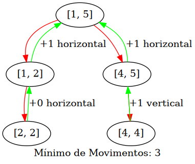

# Pintando a Cerca

**Número da Lista**: 4<br>
**Conteúdo da Disciplina**: Dividir e Conquistar<br>

## Alunos
|Matrícula | Aluno |
| -- | -- |
| 15/0129815 | Ícaro Pires de Souza Aragão |
| 16/0144752 | Sara Conceição de S. A. Silva |

## Sobre 
Solução de um problema da plataforma Codeforces que busca saber qual a quantidade mínima de movimentos, que podem ser horizontais ou verticais, para pintar uma cerca. Link para questão [aqui](https://codeforces.com/problemset/problem/448/c). [Link da submissão](https://codeforces.com/contest/448/submission/45055392).

## Visualização

Os nós representam as tábuas de madeira da cerca, as arestas vermelhas representam o algoritmo fazendo a divisão das tábuas e as arestas verdes representam o algoritmo tomando a decisão de qual movimento vai fazer, horizontal ou vertical, para pintar as tábuas de madeira.

### Input Pequeno

#### Solução



### Input Grande

#### Solução


## Instalação 

**Linguagem**: Python 3.7

Instale o pacote graphviz da sua distribuição. Ex:

``` sh
# No Fedora
sudo dnf install graphviz

# Ou no Arch
sudo pacman -S graphviz
```

e instale as dependências do python com:

``` sh
# Ou apenas pip ao invés de pip3 no Arch
# É melhor instalar na virtualenv ao invés de no usuário
pip3 install -r requirements.txt --user
```

## Uso 

Após a instalação das dependências basta executar o seguinte comando:

``` sh
python3 solution.py 
```

e seguir as intruções exibidas para gerar seu problema e sua solução.
